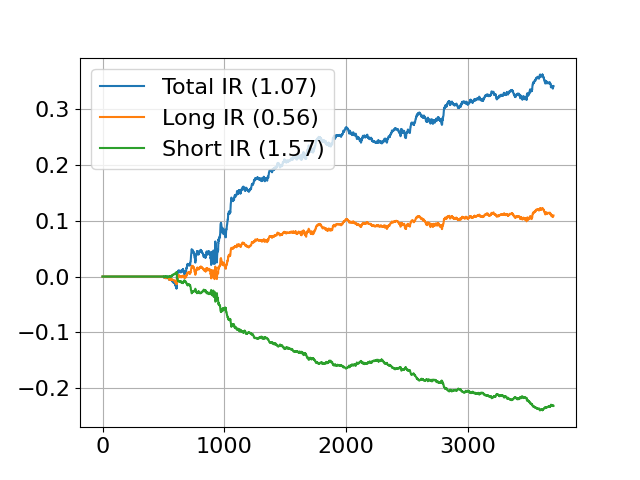
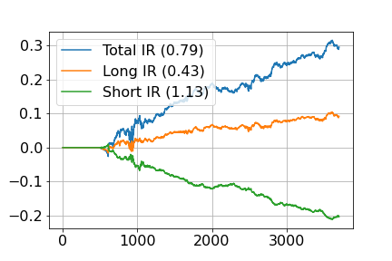
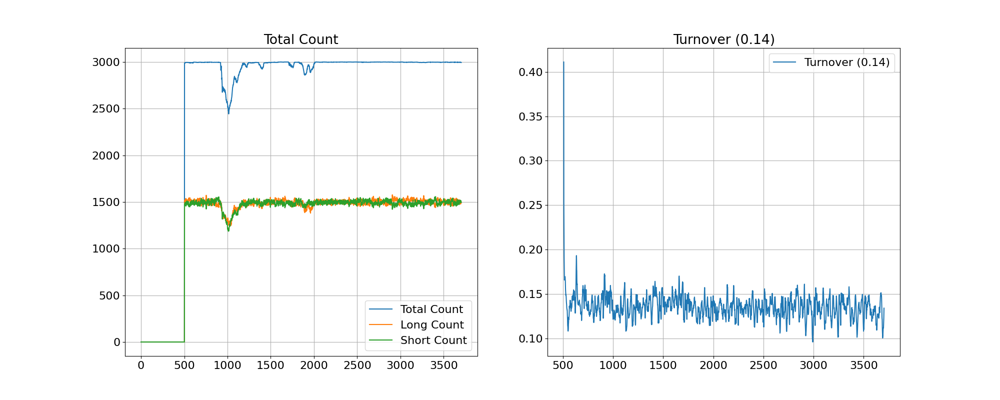

Maven Securites Prediction Signal Project
==============================================

Author: Junyo Hsieh

Email: jyh@jyhsieh.com

Notes
------
I don't have knowledge on the style of the Maven codebase, so the code is made to be PEP8-compliant.
For code logic, they are mostly embedded as docstrings for ease to follow.

Data Processing
-----------------
Since the data stored in the HDF5 file is already in an array-like and clean format,
there is no need for us to build an ORM level on top. Nonetheless, we define a simple
field enum to control the access of fields to avoid using error-prone sring literals.

Generally we don't necessarily want to filter all out-of-universe assets at the early stage.
When an asset is newly included into the universe, its out-of-universe history could still be 
relevant when computing momentum, growth, etc. time-series metrics.

However, I do not know the underlying consturction of the universe, 
and it is directly recommended in the spec to conduct filtering at the start, 
we will include it in the first-steps data pipeline. Never in universe assets
are also dropped to reduce memory consumption at runtime.

Core Idea
-----------
I built a standard mean-reversal signal with a slight twist.
Mean-reversal signals tend to underperform when external shocks are applied, 
and the "anchor level" of the asset price changes with the shock, so the asset
no longer mean-reverse. To combat this deficiency, I look to remove common latent factors 
underlying the asset return series. The most intuitive way is to take the specific return.

The specific return mean-reversal has yielded fine results, but I constructed an alternative
version that is less conventional. I run PCA on the n x s matrix of nominal returns, and 
take the residual less top components. The first principal component is likely market returns, 
followed by country and industry returns then some common factors. So in some sense the PCA residual
is akin to the specific returns, but only utilizing price/volume data.

The cross-sectional spearman/pearson correlation is low between the two signals,
and we naively combine them to yield our final signal.

Feature engineering
--------------------
Some additional steps are performed when working on the core signal:
    1. Signal Ranking
    2. Industry neutral
    3. Style exposure neutralization

First the signal is converted into a equal-distanced ranking score.
This eliminates the need to handle extreme values, and expresses that we don't
have strong conviction based on the return scale, but only the relative ordering.
The uniform weight distribution without heavy tail weightings also gives us better trading capacity. 

I then make the signal industry neutral by ranking the assets within the industry group.
Assets within the same industry tend to move together, so if we rank the entire universe,
we may very likely be betting on specific industries, but that is not inherent in our idea, so we would like to remove that bet.
I could have taken the cartesian product between industry and country to create a smore delicate grouping,
but the country distribution is heavily skewed, and could result in small groups and numerical values may misbehave.

Lastly, we neutralize all style exposures with a standard OLS projection.

Backtesting Results
---------------------

I show that the combined signal has achieved an IR > 1 before cost.
I also note that the monthly/bi-weekly spearman IC falls around 1%

I also show that the PCA version of the signal works alone as well.

Trading and Risk
-----------------
We plot the signal count, turnover. 

Since we L/S the entire universe and the weight distribution is uniform, we should not need to worry about
capacity. However, given that the universe size is 3000, if this is something akin to US equity Russell 3000 index
A lot of the asset would simply be too illiquid to trade.
Even we have neutralized size exposure, this could remain a concern.

For turnover the signal is traded at around 13%, giving the average holding period at 7~8 days.
Given my past experience on market numbers, this signal may not be directly tradable given the transaction cost.

Lastly we note that all style exposures are neutralized, so we are not (at least linearly) betting on beta.

Further works and improvements
----------------------------------------
There are still a lot that can be tried on PCA.

The PCA is not exactly identified, and can be rotated, 
so the choice of rotation matrix is a natural option to explore.
There are also cluster PCA and different specifications to try.

On the indusrty-neutral aspects, I am guessing the data is GICS.
And while GICS provide a very good and fundamental way to group stocks, there are other
clustering methods or groupings provided by other datasets that can give a different perspective.

We may also want to speed/slow the signal depending on our trading cost structure.

Also there are certainly space for runtime performance improvements.

Research Process & Parameter Fitting
----------------------------------------
The data is split into 20/80 testing/training set.
Since I do not employ any ML methods and my models are always PIT, 
I do not split another validation set.

Parameter fitting is done in a conservative fashion, only trying for
numbers that are meaningful, eg. 5, 10, 21, 63 trading days.

Appendix
------------

====    ====
Country Distribution
------------
ID      Count
====    ====
1.0     2698
2.0      163
42.0     112
41.0      27
====    ====